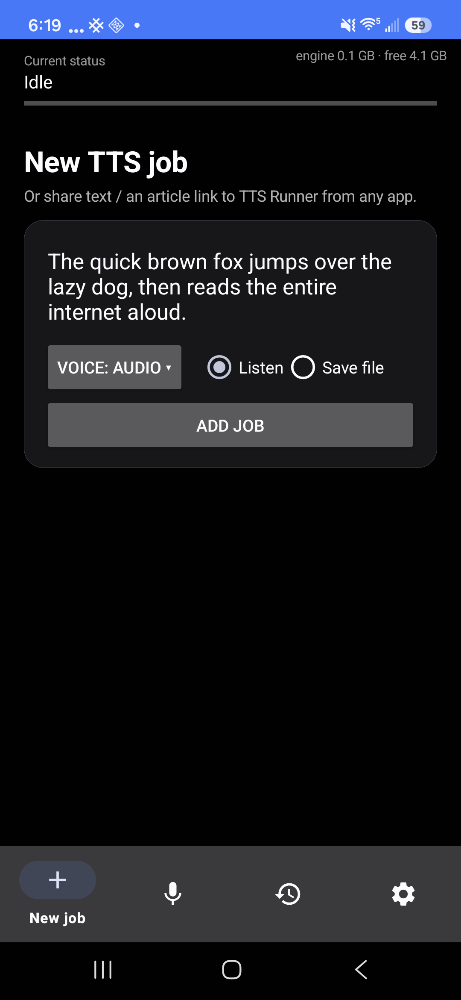
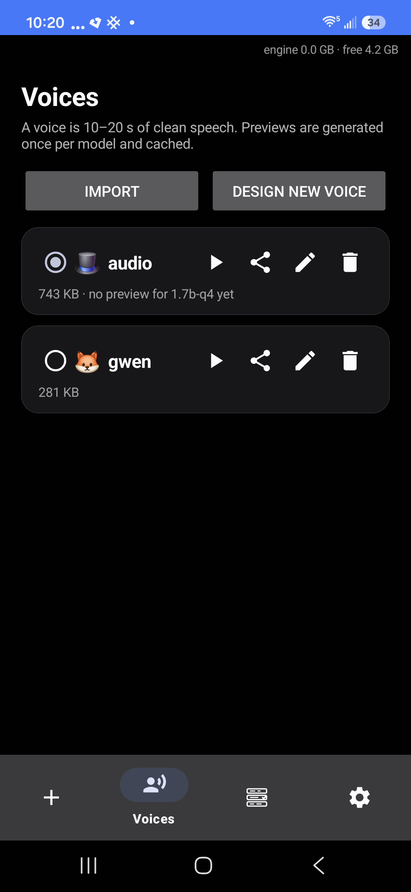

# TTS Runner — on-device Qwen3-TTS for Android

[](https://github.com/maxfridbe/vibe_android_tts_runner/actions/workflows/build.yml)

Share any text or article link to **TTS Runner** and it reads it aloud in a
cloned voice, entirely on-device: no server, no account, no audio leaving the
phone. Built on [llama.cpp](https://github.com/ggml-org/llama.cpp)'s Qwen3-TTS
support (12 Hz codec, 24 kHz audio), with speaker-embedding voice cloning from
a 10–20 s reference clip.

- **Listen or save** — stream playback, or render to `Music/TTS Runner/*.m4a`
  in the background with the screen off.
- **Voices** — clone from any recording, or *design* one (describe it, or roll
  random voices until you like one). Previews are generated once per model and
  cached.
- **Jobs** — history with per-job stats (audio length, generation time, RTF),
  re-run with a different voice, play or share the result.
- **Backends** — CPU everywhere; OpenCL on Adreno; Vulkan on everything else.
  The app detects the GPU and marks the recommended one.

Cloned from [AndroidBase](https://github.com/maxfridbe/AndroidBase): the build
is fully containerized, so the host needs only podman or docker — no Android
SDK, NDK, JDK, or Gradle install.

| New job | Voices | Jobs | Settings |
|---|---|---|---|
|  |  |  |  |

<sup>Screenshots: Galaxy S24 FE, Android 16.</sup>

## Build it

```sh
git clone https://github.com/maxfridbe/vibe_android_tts_runner.git
cd vibe_android_tts_runner
./build.sh tts-runner                       # first run also builds the image
adb install -r output/tts-runner/tts-runner-*-debug.apk
```

The first build takes a while: the builder image fetches the Android SDK/NDK,
Vulkan headers and a current `glslc`, plus a pinned llama.cpp, then compiles
llama.cpp (CPU + Vulkan + OpenCL) for arm64. Later builds reuse the image —
pass `SKIP_IMAGE_BUILD=1` to skip the check.

Signing: `build.sh` generates `keystore/` on first run (self-signed, gitignored)
and reuses it, so reinstalls always match. CI does the same; to sign with your
own key set the `ANDROID_KEYSTORE_B64` and `ANDROID_KEYSTORE_PROPERTIES` repo
secrets.

Versioning is derived from git: `versionCode` = commit count, `versionName` =
`git describe --tags --match 'v*'`, so tag `v1.2.0` builds as `1.2.0` and later
commits as `1.2.0-3-gabc1234`. Override with `VERSION_NAME` / `VERSION_CODE`.

GitHub Actions builds debug + release APKs on every push and attaches them as
artifacts; pushing a `v*` tag also publishes them to a Release.

## Use it

1. Open the app once: **Settings** → download a model (1.7B Q4_K_M, ~1.5 GB),
   **Voices** → import a recording (10–20 s of clean speech, one speaker) or
   design a voice.
2. From any app, share text or an article URL → *Read aloud (TTS Runner)*.
   Selected text works too, via the text-selection menu.
3. Or use the **New job** tab directly: paste text, pick a voice, Listen or
   Save.

Shared URLs are fetched and run through a readability pass (densest
`<article>`/`<p>` container); markdown noise, inline URLs and `[17]`-style
citations are stripped before speaking.

## Models

| Model | Source |
|---|---|
| 1.7B Q4_K_M (recommended), Q8_0 | downloaded in-app from [ggml-org/Qwen3-TTS-12Hz-1.7B-Base-GGUF](https://huggingface.co/ggml-org/Qwen3-TTS-12Hz-1.7B-Base-GGUF) |
| 1.7B Q4_0 (needed for the Adreno OpenCL kernels) | requantized on-device from the Q8 download — nobody hosts this quant |
| 1.7B VoiceDesign (description-based voice design) | downloaded in-app from this repo's [`models-v1` release](https://github.com/maxfridbe/vibe_android_tts_runner/releases/tag/models-v1) — upstream publishes no GGUF of this variant |

Everything is downloadable in-app, so a fresh install needs nothing but the
APK and network.

To rebuild the VoiceDesign GGUFs yourself, run llama.cpp's converter — this
repo's patch is required, it teaches the converter and mtmd about a codec-only
mmproj — against the
[Qwen3-TTS-12Hz-1.7B-VoiceDesign](https://huggingface.co/Qwen/Qwen3-TTS-12Hz-1.7B-VoiceDesign)
checkpoint, then publish them:

```sh
python convert_hf_to_gguf.py <checkpoint> --outfile Qwen3-TTS-VD-f16.gguf --outtype f16
python convert_hf_to_gguf.py <checkpoint> --mmproj --outfile mmproj-Qwen3-TTS-VD-Q8_0.gguf --outtype q8_0
llama-quantize Qwen3-TTS-VD-f16.gguf Qwen3-TTS-VD-Q4_K_M.gguf Q4_K_M
GH_TOKEN=... tooling/publish_models.sh Qwen3-TTS-VD-Q4_K_M.gguf mmproj-Qwen3-TTS-VD-Q8_0.gguf
```

## Architecture

```
apps/tts-runner/app/src/main/
├── cpp/
│   ├── CMakeLists.txt      # llama.cpp: CPU + Vulkan + OpenCL (Adreno kernels)
│   ├── tts_jni.cpp         # persistent engine: load once, WAV per utterance,
│   │                       # device pinning, on-device requantization
│   └── android_posix_shim.h, opencl-headers/, opencl-stub/
└── kotlin/com/maxfridbe/ttsrunner/
    ├── TtsService.kt       # foreground service in a separate ":engine"
    │                       # process (a native crash can't kill the UI);
    │                       # chunk → generate → AudioTrack/AAC pipeline
    ├── MainActivity.kt     # tabs: New job / Voices / Jobs / Settings
    ├── ShareActivity.kt    # share target: clean text → voice → job
    ├── TextCleaner.kt      # jsoup readability + plain-text cleanup
    ├── Chunker.kt          # natural-break splitting (~200 chars ≈ 15 s)
    ├── ModelManager.kt     # catalog, resumable downloads, requantize
    ├── JobStore.kt / VoiceStore.kt / AudioSaver.kt / AudioShare.kt
    └── TtsEngine.kt        # JNI facade
```

`tooling/adb_test.sh` drives a generation over adb with no screen taps.

## llama.cpp patches

`docker/patches/qwen3tts-fixes.patch` carries four fixes upstream does not
have yet (all validated on desktop CPU/Vulkan and on-device):

- **Double-read** (`mtmd-helper-gen.cpp`): the generation loop overlaid the
  text embeddings onto every generated frame — a streaming-mode leftover that
  fed the utterance to the model a second time, so it read the text twice
  (~2.3× duration, whisper-confirmed, most seeds). The official non-streaming
  pipeline adds only `tts_pad`; fixed to match. Sampling also now mirrors the
  official generation config (top_k 50, top_p 1.0, temp 0.9, repetition
  penalty 1.05, control tokens suppressed).
- **CPU crash** (`clip.cpp`, upstream issue #26632): the multi-stage generator
  leaves stage-unused graph inputs uninitialized; stale allocator memory then
  trips `GGML_ASSERT(i01 >= 0 && i01 < ne01)` in `get_rows`. Fixed by
  zero-filling graph inputs per eval.
- **Vulkan assert** (`qwen3tts-gen.cpp`): code-index views into the acoustic
  cache are 4-byte offset and the Vulkan `get_rows` kernels reject misaligned
  buffer offsets. Fixed with `ggml_cont` on those views.
- **VoiceDesign** (`mtmd.cpp`, `mtmd-helper*`, `conversion/qwen3tts.py`):
  accept a codec-only mmproj (VoiceDesign has no speaker encoder) and add
  `inp->instruct`, which tokenizes a voice description as a user turn and
  prepends it to the talker input.

When editing the patch, remember the builder image applies it to
`/opt/llama_cpp` — diffing against that tree drops earlier hunks for the same
file. Reconstruct the pristine file, apply all edits, and diff once.

To bump llama.cpp: change `LLAMA_CPP_COMMIT` in `docker/Dockerfile` and drop
patch hunks as upstream fixes land.

## Device notes

Measured with the 1.7B model, 44-character sentence:

| Device | Backend | Result |
|---|---|---|
| Galaxy Z Fold5 (SD 8 Gen 2 / Adreno 740) | CPU | 3.4 s audio in ~23 s |
| Galaxy Z Fold5 | OpenCL, Q4_0 | ~1.7× faster talker than CPU |
| Galaxy S24 FE (Exynos 2400e / Xclipse 940) | Vulkan | 3.4 s audio in ~21 s |

- **Adreno Vulkan** cannot compile llama.cpp's compute shaders
  (`createComputePipeline: ErrorUnknown`) — use OpenCL there. Adreno's OpenCL
  kernels are tuned for **Q4_0** only; other quants are far slower than CPU,
  and they abort on the codec graph, so the codec always runs on CPU.
- **Memory**: weights are mmap'd (file-backed), which keeps a 1.5 GB model off
  the reclaim path; without it phones thrash or get lmkd-killed. The engine
  falls back to a plain read if an mmap load fails (16 KB-page devices).
- **Samsung throttling**: a sustained-CPU background process gets moved to the
  little cores (`/abnormal` cpuset) within ~25 s. Active audio playback exempts
  it, so save-mode jobs play silence while generating.

Real-time generation would need the 0.6B variant; upstream llama.cpp currently
supports only the 1.7B.

## License

Apache-2.0. Model weights are downloaded at runtime and carry their own
licenses.
