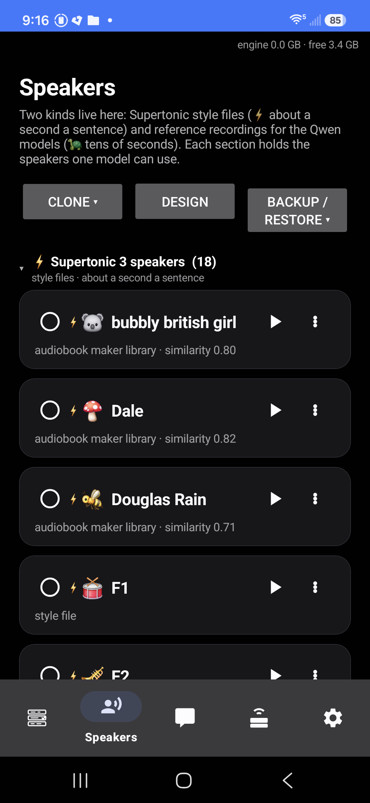
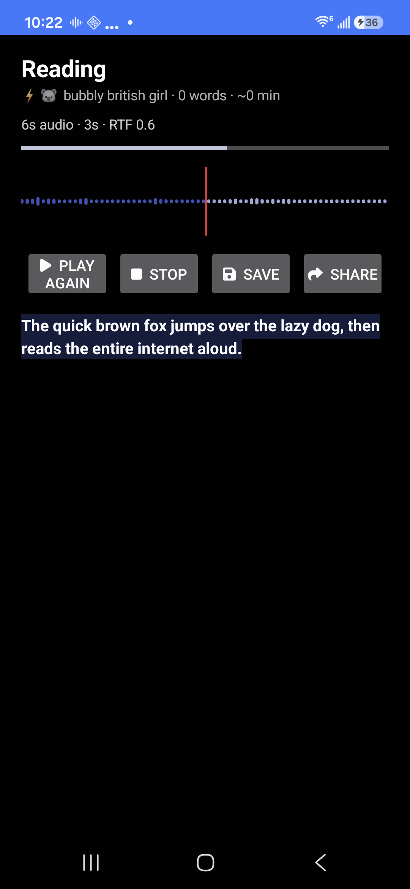
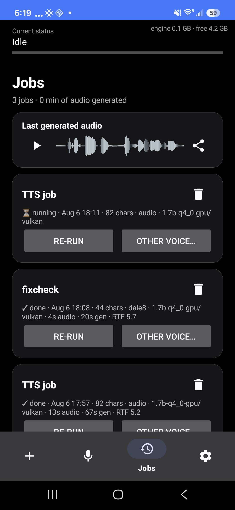
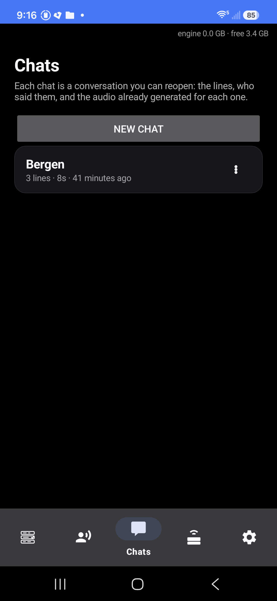
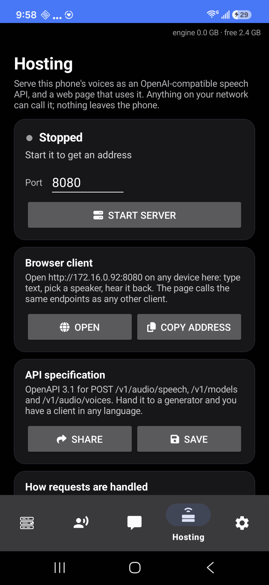
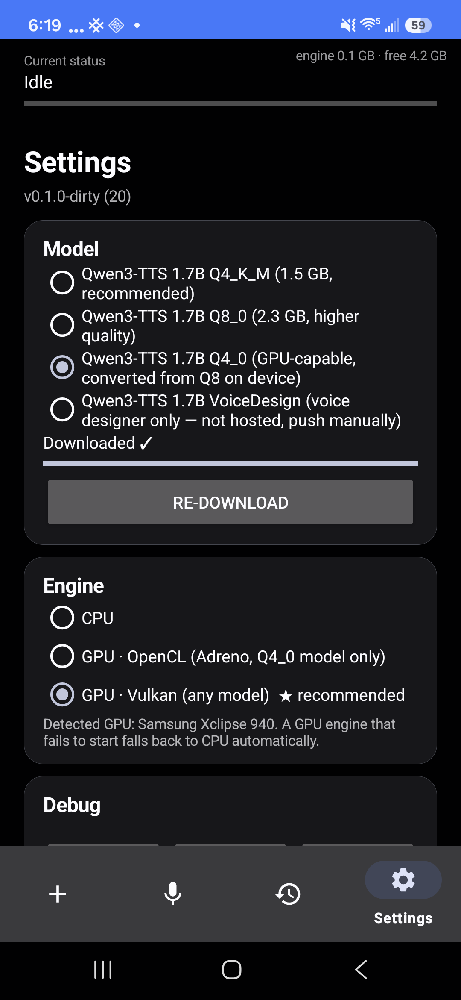

# TTS Runner — on-device Qwen3-TTS for Android

[](https://github.com/maxfridbe/vibe_android_tts_runner/actions/workflows/build.yml)
[](https://apps.obtainium.imranr.dev/redirect?r=obtainium%3A%2F%2Fapp%2F%257B%2522id%2522%253A%2522com.techhurts.ttsrunner%2522%252C%2522url%2522%253A%2522https%253A%252F%252Fgithub.com%252Fmaxfridbe%252Fvibe_android_tts_runner%2522%252C%2522author%2522%253A%2522maxfridbe%2522%252C%2522name%2522%253A%2522TTS%2520Runner%2522%252C%2522preferredApkIndex%2522%253A0%252C%2522additionalSettings%2522%253A%2522%257B%255C%2522apkFilterRegEx%255C%2522%253A%2520%255C%2522release%255C%2522%252C%2520%255C%2522invertAPKFilter%255C%2522%253A%2520false%252C%2520%255C%2522about%255C%2522%253A%2520%255C%2522On-device%2520text-to-speech%2520and%2520voice%2520cloning.%2520No%2520server%252C%2520no%2520account.%255C%2522%257D%2522%257D)

Install and auto-update straight from the GitHub releases with
[Obtainium](https://github.com/ImranR98/Obtainium) — tap the badge on your phone
(Obtainium tracks the `release` APK from each tagged release), or `adb install`
the APK below.

Share any text or article link to **TTS Runner** and it reads it aloud in a
cloned voice, entirely on-device: no server, no account, no audio leaving the
phone. Two engines ship side by side — [llama.cpp](https://github.com/ggml-org/llama.cpp)'s
Qwen3-TTS (12 Hz codec, cloning from a 10–20 s reference) and Supertonic 3
(99M ONNX, faster than real time, style voices).

- **Speakers** — a tab per engine: ⚡ Supertonic (style files) and 🐢 Qwen
  (reference recordings). Clone from a recording — trimming it to the section
  you want on a waveform first — record one now, *design* one from a
  description, import styles, or pull ready-made speakers from the built-in
  **voice library** (a set of generated, no-real-person Supertonic voices). There
  is no global "active model": the speaker you pick decides the engine and the
  model, and a ★ marks the per-engine default. A cloned voice can be **refined in
  the background on the phone** to sound closer (a gradient-free search).
- **Chats** — conversations you keep. Type a line, hear it immediately, switch
  speaker mid-scene, drag lines into the order you want, replay the whole
  thing or export it as one track. The audio travels with the line, so
  reordering costs nothing.
- **Jobs** — compose, listen or render to `Music/TTS Runner/*.m4a` with the
  screen off; history with per-job stats (audio length, generation time, RTF),
  re-run with a different voice, play or share the result.
- **Hosting** — serve the phone's voices as an OpenAI-compatible
  `POST /v1/audio/speech`, with `/openapi.yaml` and a browser client on the
  same port. Requests queue as jobs and disappear when delivered.
- **Resumable** — every generated chunk is cached, so a job the OS kills
  mid-run continues from the chunk it reached, on whichever engine you pick.
  Save jobs go further and resume *themselves*: a dead-man alarm revives the
  killed engine (same backend, never a silent switch) as long as each attempt
  makes progress, so a long job survives any number of kills unattended.
- **Backends** — per engine, and per phone: CPU / OpenCL / Vulkan for the Qwen
  models, CPU / NNAPI / XNNPACK for Supertonic. The app stars the one measured
  fastest for the detected GPU, says why, and never switches behind your back.
- **Backup folder** — point it at a real folder and every speaker is mirrored
  there, and anything the folder has that the phone lacks is imported. A
  reinstall becomes a restore.

Cloned from [AndroidBase](https://github.com/maxfridbe/AndroidBase): the build
is fully containerized, so the host needs only podman or docker — no Android
SDK, NDK, JDK, or Gradle install.

| Speakers | Player | Jobs |
|---|---|---|
|  |  |  |
| **Chats** | **Hosting** | **Settings** |
|  |  |  |

<sup>Screenshots: Galaxy S24 FE, Android 16.</sup>

## Build it

```sh
git clone https://github.com/maxfridbe/vibe_android_tts_runner.git
cd vibe_android_tts_runner
./build.sh tts-runner                       # first run also builds the image
adb install -r output/tts-runner/tts-runner-*-debug.apk
```

The first build takes a while: the builder image fetches the Android SDK/NDK,
Vulkan headers and a current `glslc`, plus a pinned llama.cpp, then compiles
llama.cpp (CPU + Vulkan + OpenCL) for arm64. Later builds reuse the image —
pass `SKIP_IMAGE_BUILD=1` to skip the check.

Signing: `build.sh` generates `keystore/` on first run (self-signed, gitignored)
and reuses it, so reinstalls always match. CI does the same; to sign with your
own key set the `ANDROID_KEYSTORE_B64` and `ANDROID_KEYSTORE_PROPERTIES` repo
secrets.

Versioning is derived from git: `versionCode` = commit count, `versionName` =
`git describe --tags --match 'v*'`, so tag `v1.2.0` builds as `1.2.0` and later
commits as `1.2.0-3-gabc1234`. Override with `VERSION_NAME` / `VERSION_CODE`.

GitHub Actions builds debug + release APKs on every push and attaches them as
artifacts; pushing a `v*` tag also publishes them to a Release.

## Use it

1. Open the app once: **Settings** → download a model (Supertonic 3 at ~400 MB
   is the fast one; the Qwen models clone from your own recordings),
   **Speakers** → Clone (from a sound file or record now), Design, or restore
   from a backup folder.
2. From any app, share text or an article URL → *Read aloud (TTS Runner)*. The
   extracted text is shown in an editor first, so you can trim whatever the
   readability pass kept before a word is spoken; then Speak, Save, or **Play
   live** for a player that grows the waveform as each chunk is generated and
   highlights the cleaned-up text line being read, with pause, save and share.
   Selected text works too, via the text-selection menu.
3. Or compose at the top of the **Jobs** tab: paste text, pick a speaker,
   Listen or Save.
4. **Chats** for conversation: a dropdown picks who speaks next, ten expression
   tags sit above the keyboard (see `docs/expression-tags.md` — they were found
   by probing the model, not documented upstream), and long-pressing a line
   drags it anywhere in the timeline.

Shared URLs are fetched and run through [Readability4J](https://github.com/dankito/Readability4J)
— the Kotlin port of Mozilla's Readability.js, the Firefox Reader View
algorithm — which drops page furniture (nav, share bars, cookie banners,
comments, related rails, interleaved newsletter promos) and keeps the article.
A hand-rolled densest-container heuristic stays as the fallback. Redirects,
including `<meta http-equiv=refresh>` stubs, are followed; then markdown noise,
inline URLs, emoji and `[17]`-style citations are stripped before speaking.

## Models

### Cloning a voice for Supertonic

Supertonic's published models contain no speaker encoder. There are two ways
round that, and they are not equivalent.

**On the phone (experimental).** Settings → *On-device voice cloning* downloads
a set of small ONNX graphs trained for this repo (`models/cloner`, and
`docs/on-device-cloning.md` for how). They predict a style from a recording in
about a second, with a **choice of two analyzers**: Qwen3-TTS's own speaker
encoder (preferred in listening — it carries character voices better) or
ECAPA. The heads are supervised regressors trained through the frozen
synthesiser on inverted-real-speaker labels; they score **0.43–0.49** held-out
speaker similarity against **0.82** for the desktop route below — a
recognisable take on the voice rather than the person.

Then a cloned style can be **refined on the phone** (a background job — leave the
app, lock the screen): a forward-only search (separable CMA-ES,
`tooling/cma_polish.py` ported to Kotlin in `RefineEngine`) decodes candidate
coefficients through the PCA basis, synthesises a short line, embeds it, and
hill-climbs the cosine to the reference — no autograd, just the forward passes
the app already runs. Over the shipped **k=384 basis** (96.1 % of style
variance) this reaches the desktop reference: measured **0.80–0.83** held-out on
several voices (e.g. a soothing British voice 0.83, a fireside narrator 0.80),
up from ~0.77 on the older k=128 basis. It's ~an hour of on-device compute for
that quality, which is why it runs in the background. Gradient inversion can't
run on a phone; this reaches the same answer without it.

**On a CUDA box (the quality reference).** It can be done offline
with [Mimocro/supertonic-voice-cloning](https://github.com/Mimocro/supertonic-voice-cloning),
which inverts the style tensors through the public ONNX weights, and
`tooling/clone_voice.sh` drives it end to end:

```sh
tooling/clone_voice.sh reference.wav "exact transcript of the recording"
# -> clone_out/reference.style.json  ->  Voices -> Import on the phone
```

The output is schema-identical to the published styles, so the phone plays it
with no changes — verified at speaker cosine 0.816 on-device versus 0.814 on
the desktop for the same style. Cloning stays a desktop step by nature: it
backpropagates through the 257 MB flow model (~0.4 s/iteration on an RTX
5070), which is thousands of times more work than the phone does to *use* the
result, and quantisation does not change that — the constraint is compute and
autograd, not model size.

Two measurements shaped the script. The inversion loop's reported cosine is
computed on the probe text it is fitting, so it cannot rank runs: an F3 start
reporting 0.90 and an F1 start reporting 0.86 scored 0.81 and 0.73 on
held-out sentences. And two runs from the *same* start landed 0.73 and 0.69.
So the script runs several starts (one per GPU at a time — two on one 12 GB
card OOM) and picks the winner with `tooling/eval_style.py`, which scores
candidates on sentences none of them were optimised against.

**Qwen3-TTS** (1.7B, llama.cpp) clones a voice from your own recording but runs
at RTF 5–6 on a phone. **Supertonic 3** (99M, ONNX Runtime) runs *below* real
time — 5.7 s of audio in 2.7 s on an S24 FE — across 31 languages, and speaks
style voices: either the ten shipped ones, styles cloned on a desktop, or the
experimental on-device encoder above.

| Model | Source |
|---|---|
| Supertonic 3 (~400 MB, 4 ONNX graphs + 10 style voices) | downloaded in-app from [Supertone/supertonic-3](https://huggingface.co/Supertone/supertonic-3) |
| 1.7B Q4_K_M (recommended), Q8_0 | downloaded in-app from [ggml-org/Qwen3-TTS-12Hz-1.7B-Base-GGUF](https://huggingface.co/ggml-org/Qwen3-TTS-12Hz-1.7B-Base-GGUF) |
| 1.7B Q4_0 (needed for the Adreno OpenCL kernels) | requantized on-device from the Q8 download — nobody hosts this quant |
| 1.7B VoiceDesign (description-based voice design) | downloaded in-app from this repo's [`models-v1` release](https://github.com/maxfridbe/vibe_android_tts_runner/releases/tag/models-v1) — upstream publishes no GGUF of this variant |

Everything is downloadable in-app, so a fresh install needs nothing but the
APK and network.

### Where each downloaded file comes from

Nothing but the APK ships in the install; every model is fetched on first use,
each from its own public host — no account or API token:

| File(s) | Source |
|---|---|
| `duration_predictor.onnx`, `text_encoder.onnx`, `vector_estimator.onnx`, `vocoder.onnx` | Supertonic 3 graphs — [huggingface.co/Supertone/supertonic-3](https://huggingface.co/Supertone/supertonic-3) `/onnx` |
| `F1`–`F5`, `M1`–`M5` style voices | the ten preset speakers — [Supertone/supertonic-3](https://huggingface.co/Supertone/supertonic-3) `/voice_styles` |
| `Qwen3-TTS-12Hz-1.7B-Base-Q4_K_M.gguf` / `-Q8_0.gguf` + `mmproj-…-Q8_0.gguf` | Qwen talker + codec projector — [huggingface.co/ggml-org/Qwen3-TTS-12Hz-1.7B-Base-GGUF](https://huggingface.co/ggml-org/Qwen3-TTS-12Hz-1.7B-Base-GGUF) |
| `Qwen3-TTS-12Hz-1.7B-Base-Q4_0.gguf` | **not downloaded** — requantized on-device from the Q8 file (nobody hosts this quant; needed for the Adreno OpenCL kernels) |
| `Qwen3-TTS-VD-Q4_K_M.gguf` + `mmproj-Qwen3-TTS-VD-Q8_0.gguf` | VoiceDesign talker + projector — this repo's [`models-v1` release](https://github.com/maxfridbe/vibe_android_tts_runner/releases/tag/models-v1) (upstream ships no VoiceDesign GGUF) |
| `spk_encoder.onnx`, `style_encoder.onnx`, `qwen_spk_encoder.onnx`, `style_encoder_qwen.onnx`, `style_basis.bin` | on-device cloning graphs — this repo's [`models/cloner`](models/cloner) via `raw.githubusercontent.com` |

The cloning graphs are fetched as raw files from the repo (no release plumbing),
and re-download automatically if a retrained model of the same name changes size.

To rebuild the VoiceDesign GGUFs yourself, run llama.cpp's converter — this
repo's patch is required, it teaches the converter and mtmd about a codec-only
mmproj — against the
[Qwen3-TTS-12Hz-1.7B-VoiceDesign](https://huggingface.co/Qwen/Qwen3-TTS-12Hz-1.7B-VoiceDesign)
checkpoint, then publish them:

```sh
python convert_hf_to_gguf.py <checkpoint> --outfile Qwen3-TTS-VD-f16.gguf --outtype f16
python convert_hf_to_gguf.py <checkpoint> --mmproj --outfile mmproj-Qwen3-TTS-VD-Q8_0.gguf --outtype q8_0
llama-quantize Qwen3-TTS-VD-f16.gguf Qwen3-TTS-VD-Q4_K_M.gguf Q4_K_M
GH_TOKEN=... tooling/publish_models.sh Qwen3-TTS-VD-Q4_K_M.gguf mmproj-Qwen3-TTS-VD-Q8_0.gguf
```

## Architecture

```
apps/tts-runner/app/src/main/
├── cpp/
│   ├── CMakeLists.txt      # llama.cpp: CPU + Vulkan + OpenCL (Adreno kernels)
│   ├── tts_jni.cpp         # persistent engine: load once, WAV per utterance,
│   │                       # device pinning, on-device requantization
│   └── android_posix_shim.h, opencl-headers/, opencl-stub/
└── kotlin/com/techhurts/ttsrunner/
    ├── TtsService.kt       # foreground service in a separate ":engine"
    │                       # process (a native crash can't kill the UI);
    │                       # chunk → generate → AudioTrack/AAC pipeline
    ├── MainActivity.kt     # tabs: Jobs / Speakers / Chats / Hosting / Settings
    ├── ShareActivity.kt    # share target: clean text → voice → job
    ├── TextCleaner.kt      # jsoup readability + plain-text cleanup
    ├── Chunker.kt          # natural-break splitting (~200 chars ≈ 15 s)
    ├── ModelManager.kt     # catalog, resumable downloads, requantize
    ├── TalkActivity.kt     # a chat as a timeline: drag to reorder, replay all
    ├── PlayerActivity.kt   # transport for a page being read: a waveform that
    │                       # grows per chunk + the text it follows karaoke-style
    ├── LiveWaveformView.kt # amplitude bars appended from the growing PCM
    ├── Icons.kt            # FontAwesome glyphs on buttons (embedded TTF)
    ├── HttpServer.kt       # OpenAI-compatible API + the browser client
    ├── HostingService.kt   # keeps it serving in the background
    ├── SynthBridge.kt      # blocking synthesis for non-UI callers
    ├── SupertonicEngine.kt # the ONNX pipeline (dp → text enc → flow → vocoder)
    ├── VoiceCloner.kt      # on-device style prediction (experimental)
    ├── RefineEngine.kt     # on-phone CMA-ES polish of a cloned style
    ├── ChatStore.kt / JobStore.kt / VoiceStore.kt / SpeakerFolder.kt
    ├── AudioSaver.kt / AudioShare.kt / Wav.kt / Backends.kt
    └── TtsEngine.kt        # JNI facade
```

`tooling/adb_test.sh` drives a generation over adb with no screen taps.

## llama.cpp patches

`docker/patches/qwen3tts-fixes.patch` carries four fixes upstream does not
have yet (all validated on desktop CPU/Vulkan and on-device):

- **Double-read** (`mtmd-helper-gen.cpp`): the generation loop overlaid the
  text embeddings onto every generated frame — a streaming-mode leftover that
  fed the utterance to the model a second time, so it read the text twice
  (~2.3× duration, whisper-confirmed, most seeds). The official non-streaming
  pipeline adds only `tts_pad`; fixed to match. Sampling also now mirrors the
  official generation config (top_k 50, top_p 1.0, temp 0.9, repetition
  penalty 1.05, control tokens suppressed).
- **CPU crash** (`clip.cpp`, upstream issue #26632): the multi-stage generator
  leaves stage-unused graph inputs uninitialized; stale allocator memory then
  trips `GGML_ASSERT(i01 >= 0 && i01 < ne01)` in `get_rows`. Fixed by
  zero-filling graph inputs per eval.
- **Vulkan assert** (`qwen3tts-gen.cpp`): code-index views into the acoustic
  cache are 4-byte offset and the Vulkan `get_rows` kernels reject misaligned
  buffer offsets. Fixed with `ggml_cont` on those views.
- **VoiceDesign** (`mtmd.cpp`, `mtmd-helper*`, `conversion/qwen3tts.py`):
  accept a codec-only mmproj (VoiceDesign has no speaker encoder) and add
  `inp->instruct`, which tokenizes a voice description as a user turn and
  prepends it to the talker input.

When editing the patch, remember the builder image applies it to
`/opt/llama_cpp` — diffing against that tree drops earlier hunks for the same
file. Reconstruct the pristine file, apply all edits, and diff once.

To bump llama.cpp: change `LLAMA_CPP_COMMIT` in `docker/Dockerfile` and drop
patch hunks as upstream fixes land.

## Device notes

Measured with the 1.7B model, 44-character sentence:

| Device | Backend | Result |
|---|---|---|
| Galaxy Z Fold5 (SD 8 Gen 2 / Adreno 740) | CPU | 3.4 s audio in ~23 s |
| Galaxy Z Fold5 | OpenCL, Q4_0 | ~1.7× faster talker than CPU |
| Galaxy S24 FE (Exynos 2400e / Xclipse 940) | Vulkan | 3.4 s audio in ~21 s |
| Galaxy S24 FE — **Supertonic 3** | CPU | 5.7 s audio in 2.7 s (RTF 0.47) |
| Galaxy Z Fold5 — **Supertonic 3** | CPU | 33 s audio in 16 s over 4 chunks (RTF 0.48) |

ONNX Runtime providers for Supertonic, same 90-character sentence:

| Device | CPU | NNAPI | XNNPACK |
|---|---|---|---|
| S24 FE (Xclipse 940) | **2.71 s** | 2.70 s | 5.65 s |
| Z Fold5 (Adreno 740) | **2.92 s** | 3.19 s | — |

NNAPI loads on both but accelerates neither: ORT falls back to CPU for the
ops these graphs use, so the timing is unchanged (Adreno is marginally
worse). XNNPACK is twice as slow here. CPU is therefore the default, while a
GPU pick still routes to NNAPI — the path that could pay off on a driver that
does support the ops.

- **Adreno Vulkan** cannot compile llama.cpp's compute shaders
  (`createComputePipeline: ErrorUnknown`) — use OpenCL there. Adreno's OpenCL
  kernels are tuned for **Q4_0** only; other quants are far slower than CPU,
  and they abort on the codec graph, so the codec always runs on CPU.
- **Memory**: weights are mmap'd (file-backed), which keeps a 1.5 GB model off
  the reclaim path; without it phones thrash or get lmkd-killed. The engine
  falls back to a plain read if an mmap load fails (16 KB-page devices).
- **lmkd kills**: on an 8 GB S24 FE the engine is still killed mid-job at
  ~2.5 GB RSS with several GB free — `dumpsys activity exit-info` records
  `reason=3 (LOW_MEMORY)` even for a foreground service on the whitelist, on
  CPU as well as GPU. Nothing in the app prevents it, which is why jobs cache
  their chunks and resume instead of restarting. Samsung honours a sticky
  service restart exactly once, so save jobs also arm an inexact alarm
  (re-armed per chunk) whose receiver revives a dead engine — measured ~5 min
  from kill to continued generation with the app UI closed.
- **Samsung throttling**: a sustained-CPU background process gets moved to the
  little cores (`/abnormal` cpuset) within ~25 s. Active audio playback exempts
  it, so save-mode jobs play silence while generating.

Real-time generation would need the 0.6B variant; upstream llama.cpp currently
supports only the 1.7B.

## License

Apache-2.0. Model weights are downloaded at runtime and carry their own
licenses.
